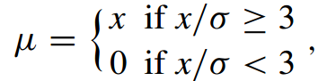
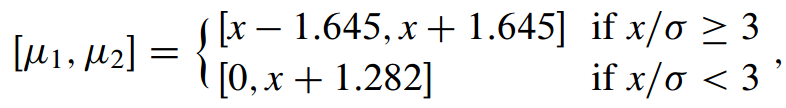
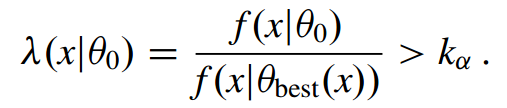
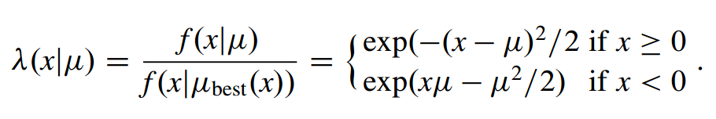
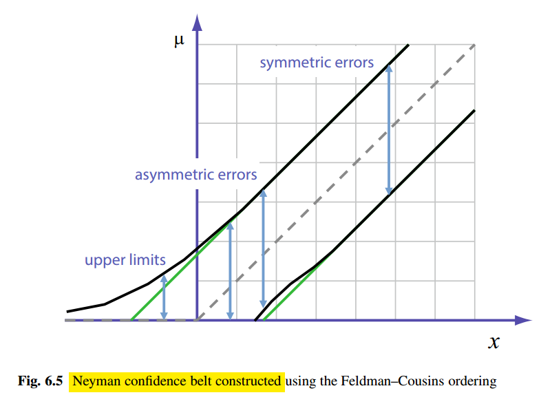

#统计 #教学

最大似然估计下定出 不确定度uncertainties的近似方法 （sect 5.6）为以下两种：
-logL 近似为 有最小值的 抛物线， 与高斯PDF近似相关
-logL最小值附近的延伸，作为可能的非对称的不确定度

但这两个方法都不保证一个 严格exact的 不确定度间隔的 覆盖。 coverage of the uncertainty intervals.
很多情况下 近似提供的level是充分的，但对 小事例数，或者PDF模型与高斯近似有明显偏差的情况下 不适用。

在频率论观点下，置信区间confidence level的严格、一般化处理是Neyman方法。
考虑变量x，根据概率分布PDF分布，依赖于未知参数$\theta$
x可以是参数$\theta$的估计量的值  
Neyman法决定confidence intervals有两步：
1. 构造confidence belt   2. 取逆确定confidence interval
#### 构造confidence belt
扫描参数空间，在$\theta$取值范围内变化$\theta$,  对固定的值$\theta = \theta_0$  对应的描述x分布的PDF, $f(x|\theta_0)$ 是已知的。
根据PDF，定出区间 $[x_1(\theta_0), x_2(\theta_0)]$  相应的概率等于 具体的confidence level,  $CL=1-\alpha = \int_{x_1(\theta_0)}^{x_2(\theta_0)} f(x|\theta_0)dx$， = 68.27%  (1$\sigma$), 90%, or 95%
此时区间的取值具有**任意性**，因此需要排序法则: ordering rule
根据固定的$\theta_0$, 在x平均值周围取值： $[<x>|_{\theta_0}-\delta, <x>|_{\theta_0}+\delta]$
反过来，可以在PDF两头极限取相等的面积  $\int_{-\infty}^{x_1(\theta_0)} f(x|\theta_0)dx = \int_{x_2(\theta_0)}^{+\infty} f(x|\theta_0)dx = \frac{\alpha}{2}$
也可以取区间长度最小的情况，或者完全非对称区间：$[x_1(\theta_0),+\infty]$ 或 $[-\infty, x_2(\theta_0)]$
Feldman-cousins 使用似然比方法，是一种特殊的ordering rule

#### confidence belt取逆

给定一个测量$x=x_0$， $\theta$的置信区间 confidence interval 通过Neyman belt取反定出， 见图6.1 右
区间$[\theta_1(x_0),\theta_2(x_0)]$   通过构造，有一个等于desired置信水平$1-\alpha$ 的覆盖。意义为： 如果参数$\theta$ =真值$\theta^{true}$,  按照PDF $f(x|\theta^{true})$ 的分布随机取$x=x_0$, 当取足够多的次数时， $\theta^{true}$落在置信区间$[\theta_1(x_0),\theta_2(x_0)]$ 的比例为$1-\alpha$

#### Binomial Intervals
二项分布 $P(n;N) = \frac{n!}{N!(N-n)!} p^N(1-p)^{N-n}$    随机取样$n=\hat n$ (或者是n次测量)，
参数p估计为 $\hat p = \frac{\hat n}{N}$
$\hat p$的不确定度的近似估计为  $\delta p \simeq \sqrt{\frac{\hat p(1-\hat p)}{N}}$.  大数定律： $n\to \infty, \hat p = p$。 若n有限值，则不成立，当$\hat n =0, N$时  $\delta p =0$, null error

解决方法：Clopper与Pearson方法
找到区间$[p_1,p_2]$ 至少给出正确的覆盖。若置信水平为$1-\alpha$, $P(n\geq \hat n|N,p_1)=\frac{\alpha}{2}$ 且$P(n\leq \hat n|N,p_2)=\frac{\alpha}{2}$ 。此时为Neyman inversion的离散情况。

离散观测量n 不允许 观测值有连续的变化， 且概率关联到可能的离散区间$[n_1(p_0), n_2(p_0)]$  此时与假设的参数值$p=p_0$有关，概率也可能为离散可能值。
在Neyman构造中 需要选最小的区间$[n_1,n_2]$   与采用的ordering rule相一致，区间至少有desired coverage。
此时，对参数p，由inversion procedure决定的置信区间$[p_1,p_2]$ 可能会overcover，有一个相应的概率大于desired $1-\alpha$   此时区间称为conservative
另一个例子：Poissonian problem （sect. 8.6）

例子6.20，计算 测量 $\hat n = N$的90% CL interval  代入二项分布式
$P(n\geq N|N,p_1)=\frac{\alpha}{2}=0.05$ 推出 $p_1 = \exp[\ln(0.05)/N]$   
$P(n\leq \hat n|N,p_2)=1$ , 推出 largest allowed $p_2 = 1$
N=10,  [0.74,1.00]  此时没有null case    对$\hat n =0, N=10$, 有[0,0.26]

#### Flip-flopping
需要采用相洽的ordering rule的选择来决定confidence intervals
Feldman-cousins表明ordering rule的选取不可以依赖于测量的outcome, 否则quoted 置信区间或upper limit不能符合正确的置信水平，或者说not respect覆盖。

rare signal实验对结果的汇报使用不同的方法，根据测量的outcome, 有从central interval到 upper limit 等不同方式。典型的选择有：
quote upper limit 若测量的信号yield不大于 其不确定度的至少3倍
quote central value with 其不确定度，若测量的信号超出三倍其不确定度
significance level $3\sigma$

flip-flopping 问题的例子：
随机变量x 遵从高斯分布，有一个已知、固定的标准差$\sigma=1$ ，未知的平均值$\mu\geq 0$ 作为singal yield或者cross section。   Quoted central value 在给定的constraint下，必须大于等于0。对于$\mu$的测量值，如果significance ($x/\sigma$) 小于$3\sigma$,  quote 0, 否则quote 所测值x, 即有：

对置信区间，给定测值x，若$x/\sigma \geq 3$, quote一个central value，带有对称误差 $\pm \sigma$ at 68.27\% CL
或者带有 $\pm 1.645\sigma$ 的误差at 90% CL。 另一方面, 若$x/\sigma<3$， quote upper limit $x^{up}$, 即置信区间$[0,x^{up}]$
$\mu$的upper limit 对应$\mu<x^{up}=x+1.282$ at 90% CL, 即Gaussian PDF下的面积。
综上， quoted置信区间at 90% CL为：

此时$\sigma =1$, 虚线为quoted central value of $\mu$ 作为测值x的函数。

基于测值x，从central interval到完全非对称区间（upper limit）产生了一个不正确的coverage, 依赖于$\mu$的值，此时$[x_1,x_2]$ 从90% 变成85%， 如红色横线的地方，比desired CL要小。

#### Feldman-cousins方法
在低观测信号yield的情况下，构造Neyman置信带，从central/ quasi-central 区间到upper limit 平滑变化，

基于似然比的ordering rule, 对未知参数$\theta$ 给定一个值$\theta_0$, 所选的变量x的区间，用来构造Neyman带，由两个x的PDF的比值来定义，其中一个在假设 $\theta=\theta_0$下，另一个在给定测值x，最大似然的最佳估计$\theta_{best}(x)$

似然比必须大于常数$k_\alpha$, 它由置信水平$1-\alpha$决定。此时置信区间对一个给定的值$\theta=\theta_0$, 
$R_\alpha(\theta_0)=\{x| \lambda(x|\theta_0)>k_\alpha\}$ , 而$\int_{R_\alpha} f(x|\theta_0)dx = 1-\alpha$

对上述例子，遵从高斯分布，$\mu=\mu_{best}(x)$ 是最大似然估计值，给定x且constraint: $\mu\geq 0$, 则$\mu_{best}(x)=max(x,0)$。 使用$\mu$的最大似然估计，对x的PDF为

求出似然比， 则对给定的$\mu=\mu_0$, 区间$[x_1(\mu_0), x_2(\mu_0)]$  可以通过对不等式$\lambda(x|\mu)>k_\alpha$ ， 以及指定的desired CL,  $1-\alpha$进行数值求解

计算结果为下图。与之前的图片比较，x越来越大时，区间越来越不对称，在某个点上变成完全不对称(即$[0,\mu^{up}]$) 定出upper limit $\mu^{up}$。 对负的x， 避免了非物理的负的$\mu$ 。这一方法从central interval到upper limit光滑过渡，保证了正确的90%的coverage

#### 8.10 $CL_s$ method
从频率论角度来说是保守的。

在贝叶斯方法下，nuisance参数的处理是well defined. (Sect 3.4)
Poisson分布的后验分布  P(s|n)  在给定观测到的值n下，