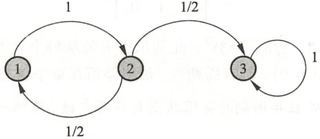
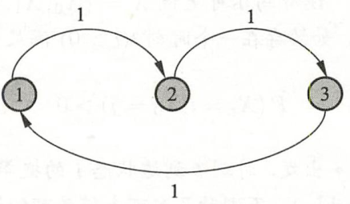
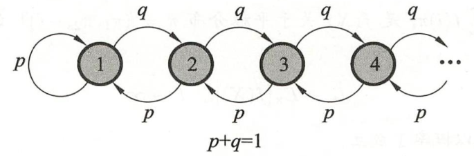

##平稳分布
$\pi = P\pi$   其中 $\pi$   为马尔可夫链 $X=\{X_0, X_1, .., X_t, ...\}$ 的平稳分布
满足充要条件 $\pi = (x_1, x_2, ..)^T$ :    $x_i = p_{ij}x_j,    x_i\geq 0,    \sum_i x_i =1$

##不可约
对任意两个状态ij，若t=0时在状态j，总存在一个时刻t>0, 到达状态i的概率大于0

##周期性

不可约且非周期的有限状态马尔可夫链，有唯一平稳分布存在。

##正常返
状态空间S，对于任意状态$i,j\in S$  时刻0从状态j出发，时刻t首次转移到状态i 的概率 $p^t_{ij}$  对所有状态都满足 $\lim_{t\to \infty} p^t_{ij}>0$. 其中任意一个状态，从其他任意一个状态出发，通过足够长的时间，首次转移到这个状态的概率不为0.

$p>q$ 有平稳分布，转移到任何状态概率不为0， 正常返，$p\leq q$ 时，不存在平稳分布，非正常返
**不可约、非周期 且正常返，有唯一平稳分布存在。**

##遍历定理

不可约、非周期 且正常返，有唯一平稳分布，转移概率的极限分布是马尔可夫链的平稳分布：
$\lim_{t\to \infty} P(X_t=i|X_0=j)=\pi_i$
对定义在状态空间S上的函数$f(X)$,  $\hat f_t=\frac{1}{t}\sum_{s=1}^t f(x_s)$ , $E_\pi[f(X)]=\sum_i f(i) \pi_i<\infty$ 是$f(X)$关于平稳分布的数学期望，则有：
当$t\to \infty$时  $\hat f_t \to E_\pi[f(X)]$  几乎处处成立或 $P\{\hat f_t \to E_\pi[f(X)]\}=1$, 即马尔可夫链的状态分布趋近于平稳分布，随机变量的函数的样本均值以概率1收敛于该函数的数学期望。

