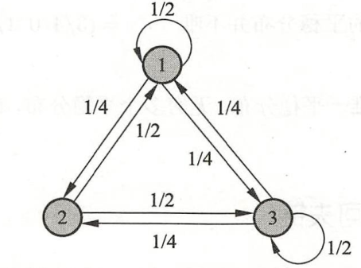

#统计 #教学

#### 平稳分布
$\pi = P\pi$   其中 $\pi$   为马尔可夫链 $X=\{X_0, X_1, .., X_t, ...\}$ 的平稳分布
满足充要条件 $\pi = (x_1, x_2, ..)^T$ :    $x_i = p_{ij}x_j,    x_i\geq 0,    \sum_i x_i =1$

#### 不可约
对任意两个状态ij，若t=0时在状态j，总存在一个时刻t>0, 到达状态i的概率大于0

#### 周期性

不可约且非周期的有限状态马尔可夫链，有唯一平稳分布存在。

#### 正常返
状态空间S，对于任意状态$i,j\in S$  时刻0从状态j出发，时刻t首次转移到状态i 的概率 $p^t_{ij}$  对所有状态都满足 $\lim_{t\to \infty} p^t_{ij}>0$. 其中任意一个状态，从其他任意一个状态出发，通过足够长的时间，首次转移到这个状态的概率不为0.

$p>q$ 有平稳分布，转移到任何状态概率不为0， 正常返，$p\leq q$ 时，不存在平稳分布，非正常返
**不可约、非周期 且正常返，有唯一平稳分布存在。**

#### 遍历定理

不可约、非周期 且正常返，有唯一平稳分布，转移概率的极限分布是马尔可夫链的平稳分布：
$\lim_{t\to \infty} P(X_t=i|X_0=j)=\pi_i$
对定义在状态空间S上的函数$f(X)$,  $\hat f_t=\frac{1}{t}\sum_{s=1}^t f(x_s)$ , $E_\pi[f(X)]=\sum_i f(i) \pi_i<\infty$ 是$f(X)$关于平稳分布的数学期望，则有：
当$t\to \infty$时  $\hat f_t \to E_\pi[f(X)]$  几乎处处成立或 $P\{\hat f_t \to E_\pi[f(X)]\}=1$, 即马尔可夫链的状态分布趋近于平稳分布，随机变量的函数的样本均值以概率1收敛于该函数的数学期望。样本均值可认为是时间均值，数学期望为空间均值。当时间趋于无穷时，时间均值等于空间均值。遍历定理条件：不可约，非周期，正常返，保证$t\to \infty$时达到任意一个状态的概率不为0. 取一个足够大整数m，m次迭代后状态分布为平稳分布。计算m+1次迭代到第n次迭代的均值，称为遍历均值：$\hat E f = \frac{1}{n-m}\sum_{i=m+1}^n f(x_i)$

#### 可逆马尔可夫链
有状态分布 满足 $p_{ji}\pi_j = p_{ij}\pi_i$  （细致平衡方程）， X称为可逆马尔可夫链。此时以平稳分布为初始，无论时间方向如何，任何一个时刻的状态分布都是该平稳分布。

不可逆马尔可夫链

#### MCMC
适用于随机变量多元，密度函数非标准，随机变量各分量不独立

PDF为$p(x)$的多元随机变量x，如何获得满足$p(x)$的样本集合，并求$E_{p(x)}[f(x)]$

在随机变量$x$的状态空间S上定义一个满足遍历定理的马尔可夫链，其平稳分布就是抽样的目标分布$p(x)$。然后在马尔可夫链上随机游走，每个时刻得到一个样本。t趋于无穷，样本的分布趋于平稳分布，样本函数均值趋近数学期望。对足够长的时间m，有n>m的时间， $\{x_{m+1},x_{m+2}, ..., x_n\}$  就是目标概率分布的抽样结果。到时刻m为止的时间称为燃烧期。随机游走的起始点不影响结果，都会收敛到同一平稳分布。

燃烧期的样本被抛弃，不需要定义建议分布，比接受-拒绝法效率更高。

(1)随机变量x的状态空间S上构造满足遍历定理的马尔可夫链，使其平稳分布为目标分布p(x)
(2) 从状态空间某一点$x_0$出发，用构造的马尔可夫链随机游走，产生样本序列$x_0, x_1, ..., x_t, ...$
(3) 马尔可夫链遍历定理，确定正整数m<n, 得到样本集合$\{x_{m+1},x_{m+2}, ..., x_n\}$,求函数$f(x)$的均值（遍历均值）
收敛步数m，迭代步数n
$\hat E f = \frac{1}{n-m}\sum_{i=m+1}^n f(x_i)$

#### 实现算法：Metroplis-Hastings算法

#### 吉布斯抽样法

